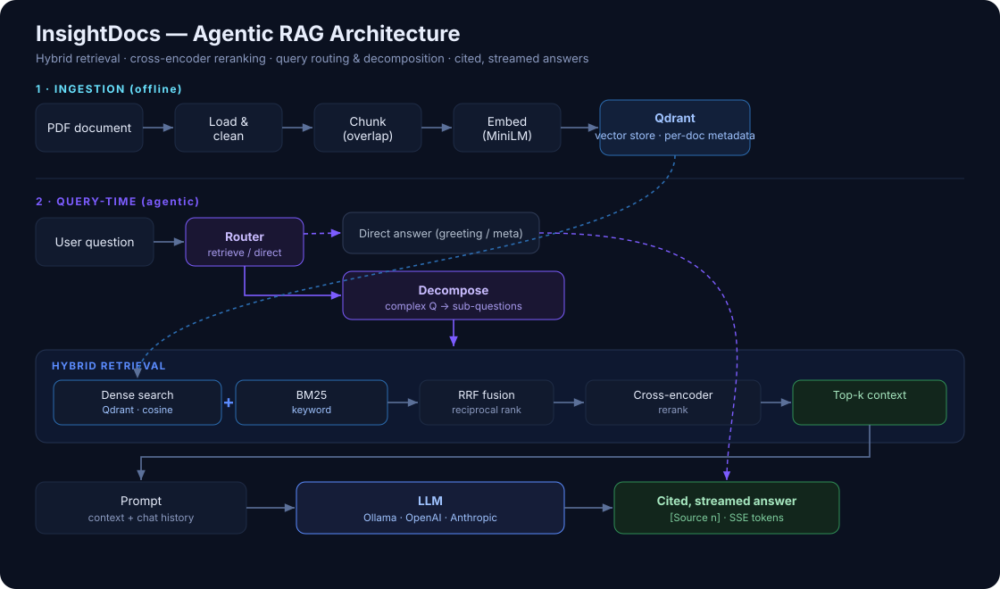

# InsightDocs — Production RAG System

[](https://github.com/ahmadad0111/insightdocs/actions/workflows/ci.yml)

A production-grade **Retrieval-Augmented Generation** system that answers
questions over your PDFs with **grounded, cited answers**. Built with FastAPI,
Qdrant, Sentence-Transformers, and a provider-switchable LLM layer
(Ollama / OpenAI / Anthropic).

What makes it more than a demo:

- **Hybrid retrieval** — dense vector search **+ BM25 keyword search**, fused with Reciprocal Rank Fusion.
- **Cross-encoder reranking** — a supervised reranker reorders candidates for much higher precision.
- **Evaluation harness** — quantitative retrieval **and** answer-quality metrics (context precision/recall, MRR, faithfulness, answer F1) with an A/B guide.
- **Document management** — stable `document_id`s, **upsert-based updates** (re-uploading a file updates it in place), plus list / delete / reset.
- **Provider-switchable LLM** — one env var swaps between local Ollama and OpenAI/Anthropic.
- **Agentic layer** — a router answers greetings/meta directly (no wasted retrieval), and a decomposer splits complex questions into sub-questions, retrieves each, and merges the context before answering.
- **Streaming web UI** — chat interface with token streaming, inline source citations, drag-and-drop upload, and a note when the agent decomposes a query.

## Demo

Ask a question and get a streamed, grounded answer with inline source citations:


## Architecture



<details>
<summary>ASCII version</summary>

```
                 ┌─────────────┐
   PDF  ──▶ Load ─▶  Chunk  ─▶ Embed ─▶  Qdrant (vector store, per-doc metadata)
                 └─────────────┘                       │
                                                       ▼
Question ─▶ Embed ─▶ Dense search ┐            ┌─ BM25 keyword search
                                  ├─ RRF fusion ┤
                                  ▼            └─────────────┐
                          Cross-encoder rerank ─▶ Top-k context
                                                       │
                                                       ▼
                              Prompt (context + history) ─▶ LLM ─▶ streamed, cited answer
```

</details>

## Quick start

```bash
cp .env.example .env          # then edit provider / keys

# Option A — local, free (Ollama)
docker compose --profile ollama up --build -d
docker exec -it insightdocs-ollama ollama pull llama3

# Option B — OpenAI/Anthropic (set LLM_PROVIDER + API key in .env)
docker compose up --build -d
```

Open the UI at **http://localhost:8000/app**, upload a PDF, and ask away.

### Run locally without Docker

```bash
python -m venv .venv && source .venv/bin/activate
pip install -r requirements.txt
# start Qdrant (docker run -p 6333:6333 qdrant/qdrant) and your LLM
uvicorn src.api.main:app --reload
```

## API

| Method | Path | Description |
|---|---|---|
| POST | `/documents` | Upload + index a PDF (re-upload updates in place) |
| GET | `/documents` | List indexed documents |
| DELETE | `/documents/{id}` | Delete one document |
| DELETE | `/documents` | Reset the whole collection |
| POST | `/query` | Ask a question → `{answer, sources, latency_ms}` |
| POST | `/stream` | Same, streamed via Server-Sent Events |
| GET | `/health`, `/version` | Health + config |

Queries accept an optional `document_ids` list to scope the search.

## Agentic layer

Enabled by default (`USE_AGENTIC=true`). Two behaviours sit in front of retrieval:

1. **Router** (`src/rag/agentic/router.py`) — classifies each message as
   `direct` (greeting / small talk / "what can you do?") or `retrieve`. Direct
   messages are answered without touching the vector store. A confident
   heuristic short-circuits the obvious cases; the LLM handles the rest.
2. **Query decomposition** (`src/rag/agentic/decomposer.py`) — a complex,
   multi-part question is split into focused sub-questions, each retrieved
   separately, and their contexts merged and de-duplicated before a single
   grounded answer is generated. Simple questions pass through untouched.

Both fall back to deterministic behaviour if the LLM is unavailable, and the
pure logic (routing rules, sub-question parsing, fusion) is unit-tested.

Toggle it for an A/B in your evaluation:

```bash
USE_AGENTIC=false python -m eval.run_eval --eval eval/eval_set.json
USE_AGENTIC=true  python -m eval.run_eval --eval eval/eval_set.json
```

## Evaluation

> The eval set is grounded in the sample paper *"Towards Federated Learning at Scale: System Design"* (Bonawitz et al., MLSys 2019, [arXiv:1902.01046](https://arxiv.org/abs/1902.01046)). The PDF is not committed; download it with `curl -L -o data/raw/federated_learning.pdf https://arxiv.org/pdf/1902.01046` (see `data/raw/README.md`).

```bash
python -m eval.run_eval --ingest data/raw/federated_learning.pdf
python -m eval.run_eval --eval eval/eval_set.json
```

Prove the retrieval upgrades pay off by A/B-ing the flags:

```bash
USE_HYBRID=false USE_RERANKER=false python -m eval.run_eval --eval eval/eval_set.json
USE_HYBRID=true  USE_RERANKER=true  python -m eval.run_eval --eval eval/eval_set.json
```

Drop the before/after numbers into this README and your resume. See `eval/README.md`.

## Tests

```bash
pip install pytest
pytest -q          # pure-logic unit tests (chunking, memory, fusion, metrics, prompt)
```

## Configuration

All via environment variables — see `.env.example`. Highlights:
`LLM_PROVIDER` (ollama|openai|anthropic), `EMBEDDING_MODEL`, `USE_HYBRID`,
`USE_RERANKER`, `RERANKER_MODEL`, `TOP_K`, `CANDIDATE_K`.

## Project structure

```
src/
  api/            FastAPI app factory, routes (health, query, documents), schemas, DI
  core/           config + logging
  rag/
    ingestion/    pdf_loader, chunker
    embeddings/   embedder
    retrieval/    vector_store (doc mgmt), hybrid (BM25+dense+RRF), reranker
    generation/   llm (provider factory), rag_chain
    agentic/      router, decomposer, agent (orchestrator)
    memory/       conversation_memory
  services/       document_ingestion_service, rag_service
eval/             metrics, eval_set, run_eval
frontend/         streaming chat UI
tests/            unit tests
```

## Development workflow

Built with a branch-per-feature workflow merged into `release/v1.0`:
`feature/foundation` → `feature/doc-management` → `feature/retrieval-quality`
→ `feature/evaluation` → `feature/frontend` → `feature/agentic`.

## Roadmap

Conversational memory upgrades, query decomposition / agentic routing,
Redis caching with latency benchmarks, and optional LLM-judged RAGAS evaluation.
